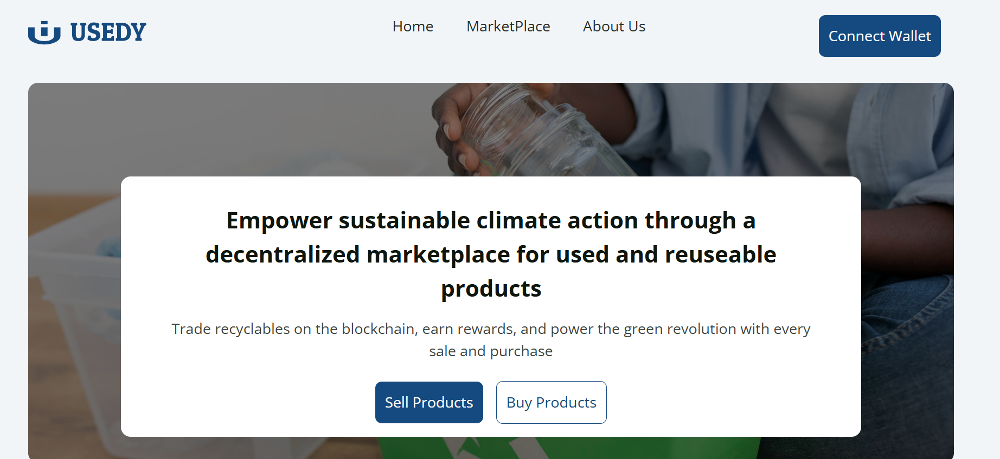
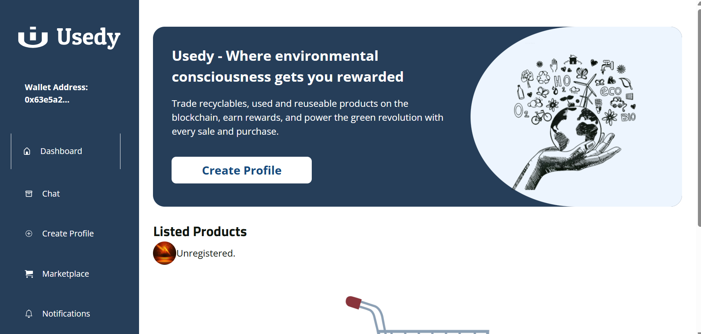

## Usedy

## Product Overview:

Usedy is a decentralised marketplace application designed to incentivise and empower individuals, recyclable/reusable material sellers, recyclable/reusable centres, companies, and other buyers to participate actively in sustainable waste management and recycling efforts. By leveraging blockchain technology, Usedy connects sellers offering recyclable/reusable materials with buyers in a transparent and rewarding ecosystem. Sellers list their recyclable/reuseable materials/products while the buyers make purchases of these recyclable/reuseable products using blockchain The users (the sellers and buyers) are rewarded with a token in the form of usedy points, which upon accumulation to a certain amount can be exchanged for a valuable token and used to purchase eco-friendly products, services, or carbon offset certificates.

## Problem Statement:

Efficient waste management and recycling remain a significant challenge worldwide. Finding recyclable/reusable materials for purchase and motivating sellers to participate in recycling efforts are persistent issues. There is a lack of transparency and incentives to drive recycling participation effectively. These challenges hinder progress in mitigating climate change and achieving sustainable carbon reduction goals.

## Proposed Solution:

Usedy addresses these challenges by providing a decentralised marketplace for recyclable/reusable materials, integrating blockchain technology for secure, transparent transactions, and introducing a tokenised reward system in the form of GRP. The product leverages blockchain technology to revolutionize waste management and recycling, creating a solution that not only encourages participation but also promotes sustainability and environmental consciousness.

## Screenshots

- 1

- 2

## Value Proposition

Usedy differentiates itself by leveraging blockchain technology and providing a decentralised marketplace with tokenised rewards, adding a layer of transparency and security to transactions.

## Product Goals:

Enable users' product listing and purchases through the secure blockchain network. 

Increase Recycling Participation: Encourage more sellers to participate in recycling efforts by rewarding them with usedy tokens.

Facilitate Secure Transactions: Ensure secure and transparent transactions through blockchain payments.

Enhance User Trust: Build trust within the platform through user ratings, reviews, and transparent transactions.

## Key Features and Functionalities:

User Registration and Onboarding: Users register and create profiles, providing essential information (name, email and password).

  

## Listing Functionality:

Sellers: Sellers can list recyclable/reusable materials/products, including images, a description of the recyclable/reusable product, the type of recyclable/reusable material, quantity, prices per unit of measure (e.g., gram), and location.

Sellers get rewarded with a usedy (10 points) upon successful product listing. 

Sellers can edit listed products after listing successfully. 

## Search and Purchase functionality 

Buyers: Buyers can search for recyclable/reusable materials based on various filters like type, quantity, price, and location.

Buyers can view detailed product listings, including images, descriptions, price, UOM, quantity and seller location, and ratings.

Users determine the delivery kinds (self-pick up/buyer self-delivery or seller delivery) and view the relative cost. 

Secure Blockchain Payments:

Buyers can initiate purchases and make secure payments using blockchain technology, ensuring transparency and trust in transactions. 

## Transaction Management:

Smart contracts facilitate secure and transparent transactions.

Escrow service holds payments made until buyers confirm receipt of recyclable/reusable materials.

Once confirmed, cryptocurrency payments are released to sellers in their wallets. 

## Target Audience:

Individuals interested in recycling and sustainability.

Recyclable/reusable material sellers, collectors, and businesses.

Buyers seeking recyclable/reusable materials for recycling.

Revenue

1% Transaction Fees on every successful and completed transaction

## Conclusion:

Usedy is committed to making recycling more accessible, rewarding, and environmentally impactful. By connecting recyclable/reusable product sellers and buyers through blockchain technology.

With a decentralised marketplace functionality and blockchain technology to incentivise recycling and promote sustainable waste management. Usedy empowers individuals, businesses, and organisations to participate actively in the recycling ecosystem; hence, it encourages sustainable waste management practices and contributes to a greener, more eco-conscious world.

[Pictorial Representation](public/screenshot3.jpg)

### Contract Deployed:
UsedyToken deployed to 0x38b0917178b0C07bEAAf9c6255Ad97C1c9D984EE

UsedyContract deployed to 0xF2837cD516f35686cBfD91B8A523abE6216DdE52

### Demo Link

https://www.youtube.com/watch?v=t8o2QFjf-n0 

### Pitch Deck:

https://www.canva.com/design/DAGoERqNFUQ/e_Wb0RgcEIK0_2bcsTZdvQ/view?utm_content=DAGoERqNFUQ&utm_campaign=designshare&utm_medium=link2&utm_source=uniquelinks&utlId=h39daa69549

